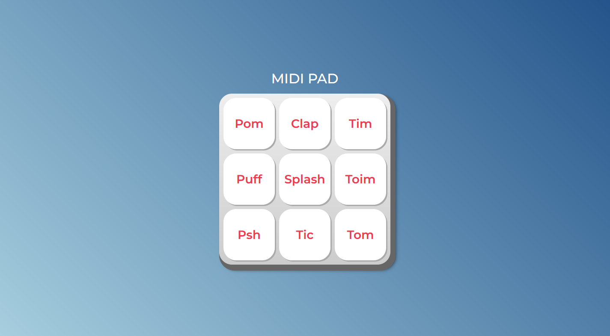

# MIDI Pad

## Descrição

MIDI Pad é um aplicativo web interativo que simula um controlador MIDI virtual. Ele permite que você toque sons de bateria e outros efeitos sonoros usando o teclado do seu computador ou dispositivos sensíveis ao toque.

## Recursos

- Interface intuitiva e responsiva que se adapta a diferentes tamanhos de tela.
- Suporte para tocar sons de bateria e efeitos sonoros.
- Integração com teclado do computador e dispositivos sensíveis ao toque para controle de som.
- Layout personalizável com diferentes conjuntos de sons disponíveis.
- Feedback visual ao pressionar os botões do MIDI Pad.

## Como usar

1. Acesse [MIDI Pad](https://melksedeque.github.io/midi-pad/) usando seu navegador da web.
2. Na interface do MIDI Pad, você verá um conjunto de botões dispostos em uma grade.
3. Cada botão representa um som específico, como um ritmo de bateria ou um efeito sonoro.
4. Para tocar um som, você pode:
   - Clicar em um botão usando o mouse.
   - Pressionar a tecla correspondente no teclado do seu computador (as teclas são indicadas nos botões).
   - Toque o botão diretamente em um dispositivo sensível ao toque (se estiver em um celular ou tablet).
5. Explore diferentes botões e sons para criar seus próprios ritmos e efeitos sonoros.
6. Experimente layouts diferentes disponíveis para alterar o conjunto de sons exibidos no MIDI Pad.
7. Divirta-se explorando e fazendo música com o MIDI Pad!

## Requisitos do sistema

- Navegador da web atualizado (recomendado: Google Chrome, Mozilla Firefox, Safari).

## Contribuição

Este projeto está em desenvolvimento ativo e contribuições são bem-vindas. Se você tiver sugestões, melhorias ou correções de bugs, sinta-se à vontade para abrir uma pull request ou relatar problemas na seção "Issues" do projeto.